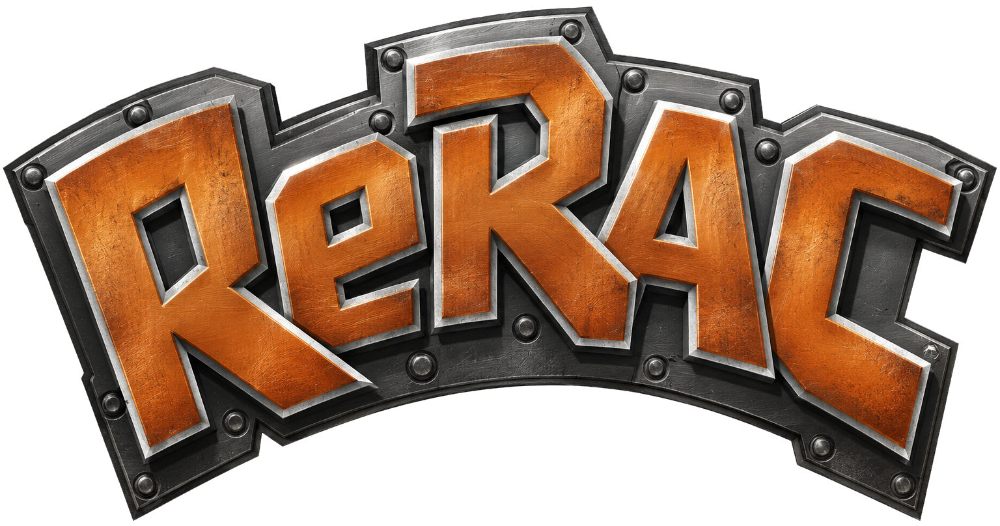

<p align="center">
  
</p>

<h1 align="center">ReRAC Launcher</h1>

<p align="center">
  <a href="https://re-rac.github.io">Website</a> ·
  <a href="https://github.com/re-rac/rerac">Game</a> ·
  <a href="https://github.com/re-rac/rerac-launcher">Launcher</a>
</p>

The ReRAC launcher installs and updates versions of [ReRAC](https://github.com/re-rac/rerac), a native rewrite of the
PlayStation 2 game Ratchet & Clank (2002). It extracts the game data from your own disc image and starts the game.
Mod management is planned. It is built with [Tauri](https://v2.tauri.app/).

> [!WARNING]
> ReRAC is an unofficial fan project, not affiliated with or endorsed by Sony Interactive Entertainment or Insomniac
> Games. You need your own, legally obtained PlayStation 2 disc of Ratchet & Clank (NTSC-U, SCUS-97199, version 1.00).
> Neither the launcher nor the game contains any game assets.

- [Usage](#usage)
- [Asking for help](#asking-for-help)
- [Development](#development)
  - [Prerequisites](#prerequisites)
  - [Building and running](#building-and-running)
  - [Running a local build of the game](#running-a-local-build-of-the-game)
  - [Testing without the game](#testing-without-the-game)
  - [Releasing](#releasing)
- [Related](#related)
- [License](#license)

## Usage

Website documentation: coming later. Nothing has been released yet, so for now you need a game build from the game
repository (see [Running a local build of the game](#running-a-local-build-of-the-game)).

1. **Add a game version.** Settings → Version Management → Development → **Install from zip…** (or **Add build
   folder…**), then **Set active**. Official releases will be downloadable from Settings → Version Management →
   Official once they are published.
2. **Install the game data.** Ratchet & Clank in the sidebar → **Install via ISO**, then pick the image of your disc.
   The active version's extractor checks the disc, copies the data (about 4.5 GB) and prepares it.
3. **Play.** The launcher starts the game with the extracted data and shows *Running…* until it exits.
4. **Optional:** the game screen's **⋯** menu has **Export assets…** (textures, audio, models, levels, collision and
   text as PNG, WAV, glTF and JSON) and **Re-extract from ISO**.

If the game cannot start, the launcher says why and offers **Re-extract** when the data is missing, incomplete or
made for another version.

## Asking for help

The launcher has no support-package export. Attach your log files to the report instead: Help → **Logs folder**, or
Settings → Folders → **Open logs**, opens the folder. Every extraction, verification, asset export and game session
writes its own file there (`extract-rac1-<time>.log`, `verify-rac1-<time>.log`, `export-rac1-<time>.log`,
`rac1-<time>.log`). The launcher itself writes only `launcher.log`, for one-off notes such as copying the data
folder from before the rename to ReRAC (the old `randcrw` folder is copied once to `rerac` and left as it was).

With the default data folder, the logs are in:

- Windows: `C:\Users\<YOUR_USER_NAME>\AppData\Local\rerac\logs`
- Linux: `/home/<YOUR_USER_NAME>/.local/share/rerac/logs` (or `$XDG_DATA_HOME/rerac/logs` when that is set)
- macOS: `/Users/<YOUR_USER_NAME>/Library/Application Support/rerac/logs`

These folders are hidden by default. If you moved the data folder (Settings → Folders), the logs moved with it into
`<your data folder>/logs`.

## Development

The Tauri 2 backend (Rust, in `src-tauri/`) does all file, process, dialog and network work; the React 19 +
TypeScript + Vite page in `src/` is a thin view. The interface between the launcher, the extractor and the game is
in [`docs/contract.md`](docs/contract.md). Development happens on macOS; Windows and Linux are untested.

### Prerequisites

- Rust, stable, through [rustup](https://rustup.rs) (the crate needs 1.77 or later).
- [Node.js](https://nodejs.org) with npm. `package.json` pins no version; a current LTS works.

Plus the Tauri 2 system dependencies for your OS ([Tauri prerequisites](https://v2.tauri.app/start/prerequisites/)):

#### Windows

Install the [Microsoft C++ Build Tools](https://visualstudio.microsoft.com/visual-cpp-build-tools/) with the
"Desktop development with C++" workload. WebView2 ships with Windows 10 (1803 and later) and Windows 11; on older
systems install it as described in the Tauri prerequisites.

#### Linux

On Debian and Ubuntu:

```sh
sudo apt update
sudo apt install libwebkit2gtk-4.1-dev build-essential curl wget file libxdo-dev libssl-dev libayatana-appindicator3-dev librsvg2-dev
```

Other distributions: see the [Tauri prerequisites](https://v2.tauri.app/start/prerequisites/#linux).

#### macOS

```sh
xcode-select --install
```

### Building and running

```sh
npm install
npm run tauri dev
```

Other commands:

```sh
npm run dev                    # the page alone in a browser at http://localhost:1420, with a mocked backend
npm run build                  # typecheck and production build of the page
npm run tauri build            # release bundle
cd src-tauri && cargo test     # backend tests
cd src-tauri && cargo clippy
```

To keep a test run away from your real data folder, point the launcher at another one:

```sh
RERAC_DATA_ROOT=/some/dir npm run tauri dev
```

### Running a local build of the game

In your local checkout of [re-rac/rerac](https://github.com/re-rac/rerac), `cargo xtask package` makes a version folder and a zip,
`dist/rerac-<version>-<os>-<arch>.zip`. In the launcher, Settings → Version Management → Development →
**Install from zip…** installs it into `<data folder>/versions/development/<version>/`; **Add build folder…** with the
unpacked `dist/rerac-<version>-<os>-<arch>/` folder uses it in place instead. Then **Set active**. There is no
environment variable for this; the Development source is the only way.

The game's own documentation for this is `docs/workflows/launcher.md` in the game repository.

`src-tauri/tests/e2e_real_build.rs` runs the whole path (install the zip, extract your disc image, start the game,
check the exit codes) against a real build. It is ignored by default; its environment variables are documented at the
top of the file.

### Testing without the game

- **Browser mock.** `npm run dev` uses `src/backend/mock.ts` instead of the Rust backend. URL parameters pick a state,
  for example `/?mock=extracting`, `/?mock=installed`, `/?mock=error21`, `/?mock=playing`, or
  `#/settings/versions/development`. The full list is in `src/backend/mock.ts`.
- **Mock game version.** `dev/mock/` is a complete fake version folder whose extractor and runtime are small Node
  scripts that follow the contract. Add it under Settings → Version Management → Development, set it active, and
  install from any `.iso` file. `dev/mock/make-test-isos.sh <dir>` makes empty test images whose file names steer
  the outcome: `(USA)` succeeds, `Europe` or `PAL` gives error 21, `notrac` error 20, `errNN` any code.
  `RERAC_MOCK_ERROR=<code>` forces a code, `RERAC_MOCK_SECONDS` sets the copy time,
  `RERAC_MOCK_VERIFY_FAIL=1` fails verification, and `RERAC_MOCK_RUN_SECONDS` sets how long the mock game runs.
  These scripts need Node on `PATH` (macOS and Linux).
- **Real extractor, mock game.** `dev/make-real-extractor-version.sh` makes `dev/real/` (git-ignored) with the game
  repository's real `rerac-extract` and the mock runtime. Add that folder under Development instead. It looks for the
  game in `$RERAC_GAME_DIR`, your local checkout of re-rac/rerac (default: the sibling folder `../randcre`).

### Releasing

Releases are built by GitHub Actions (`.github/workflows/release.yml`) when a `v*` tag is pushed.

1. Set the version in `package.json` (`tauri.conf.json` reads it from there) and in `src-tauri/Cargo.toml`, then run
   `cargo check` in `src-tauri` to update `Cargo.lock`. The version is numbers only (`0.2.0`), because the macOS and
   Windows installers require that; a prerelease suffix goes on the tag only.
2. Add a `## vX.Y.Z[-pre]` section to `CHANGELOG.md`, for players, one paragraph per line. It becomes the release
   notes; the workflow stops if the section is missing.
3. Commit, tag and push the tag:

   ```sh
   git tag -a v0.2.0-beta.1 -m "ReRAC Launcher v0.2.0-beta.1"
   git push origin main v0.2.0-beta.1
   ```

The workflow creates a draft release, builds macOS (Apple Silicon and Intel), Windows and Linux in parallel, uploads
each installer twice (tauri-action's versioned name and a stable one: `rerac-launcher-macos-arm64.dmg`,
`rerac-launcher-macos-x64.dmg`, `rerac-launcher-windows-x64.msi`, `rerac-launcher-linux-x86_64.AppImage`), and then
publishes it once both macOS installers are there. Windows and Linux are untested and do not block the release. Tags
containing `-alpha`, `-beta` or `-rc` become prereleases. The website links to
`/releases/latest/download/<stable name>`, and GitHub's "latest" skips prereleases, so those links work only once a
release without a suffix exists.

Secrets (Settings → Secrets and variables → Actions):

- Needed now: none. The workflow uses the built-in `GITHUB_TOKEN`.
- Optional: `SITE_DISPATCH_TOKEN`, a token that may write to `re-rac/re-rac.github.io`. When it is set, publishing
  sends that repository a `release-published` dispatch so the website rebuilds.
- Later, macOS signing and notarization: `APPLE_CERTIFICATE`, `APPLE_CERTIFICATE_PASSWORD`, `APPLE_SIGNING_IDENTITY`,
  `APPLE_ID`, `APPLE_PASSWORD`, `APPLE_TEAM_ID`.
- Later, the Tauri updater: `TAURI_SIGNING_PRIVATE_KEY`, `TAURI_SIGNING_PRIVATE_KEY_PASSWORD` (plus the updater plugin
  and its public key in `tauri.conf.json`).

The signing lines are in the workflow, commented out; uncomment them once the secrets exist.

## Related

- [re-rac/rerac](https://github.com/re-rac/rerac), the game repository (private for now): the game, the extractor,
  and the packaging that produces the version zips this launcher installs.
- [re-rac.github.io](https://re-rac.github.io), the project website.
- [re-rac/rerac-launcher](https://github.com/re-rac/rerac-launcher), this repository.

## License

No license is declared: `package.json` is marked private and `src-tauri/Cargo.toml` names no license, and there is no
license file. The bundled fonts, Russo One and Exo 2, are under the SIL Open Font License 1.1
([`src/assets/fonts/LICENSES.md`](src/assets/fonts/LICENSES.md)).
